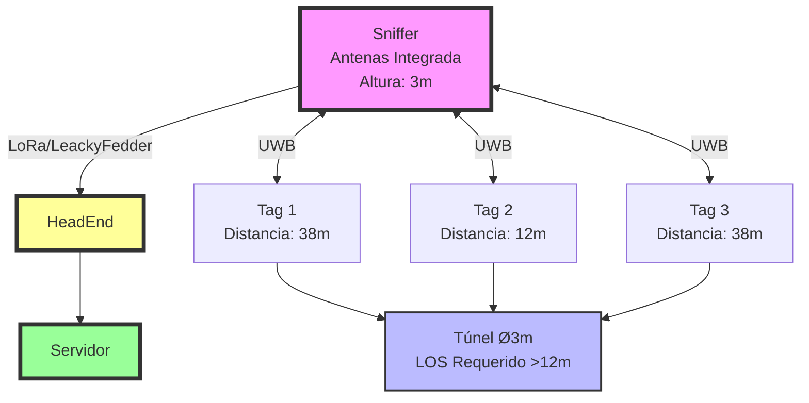

# Esquema del Sniffer y Rangos de Detección

## Vista Esquemática

El Sniffer está ubicado en el centro de un túnel minero, con antena integrada omnidireccional. Los rangos de detección se extienden lateralmente hasta 38 metros en condiciones óptimas (LOS, 12V, orientación favorable).

### Diagrama Esquemático

### Descripción

- **Sniffer Central:** Unidad fija con antena UWB integrada internamente.
- **Rango Lateral:** Hasta 38 metros en línea de vista óptima.
- **Condiciones:** Alimentación 12V DC, orientación vertical de antenas.
- **Limitaciones:** Rango se reduce a 12m con orientación desfavorable o NLOS.

**Nota:** Este esquema representa una vista lateral simplificada. El patrón de antena es omnidireccional en el plano horizontal.