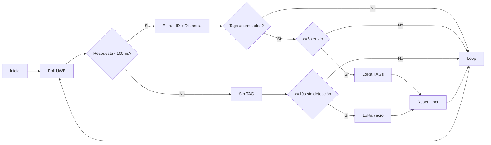

# STM32 Projects Collection

This repository contains four STM32-based projects for different communication and sensing applications.

## Projects Overview

### 1. Sniffer Project
- **MCU**: STM32G474RET
- **Description**: A sniffer implementation for monitoring and analyzing communications.
- **Key Features**:
  - Distance handling capabilities
  - LORA communication support (SX1278)
  - EEPROM memory management
  - UART communication
  - UWB (Ultra-wideband) support with DW3000 chip

### 2. RDSS Master TX (Transmitter)
- **MCU**: STM32F103C8
- **Description**: Master transmitter node for RDSS (Radio Determination Satellite Service) system
- **Key Features**:
  - LORA communication (SX1278)
  - Command message handling
  - GPIO control
  - Memory management
  - UART communication interface

### 3. RDSS Master RX (Receiver)
- **MCU**: STM32F103C8
- **Description**: Master receiver node for RDSS system
- **Key Features**:
  - LORA communication (SX1278)
  - Command message processing
  - GPIO handling
  - Memory management
  - UART communication interface

### 4. Persona Project
- **MCU**: STM32U535VET
- **Description**: Advanced communication and control system
- **Key Features**:
  - UWB (Ultra-wideband) communication
  - Battery management (BQ25150)
  - RGB LED control (WS2812)
  - I2C communication
  - GPIO management
  - Advanced power management features

## Common Features Across Projects

- **Hardware Abstraction Layer (HAL)** support
- **CMSIS** (Cortex Microcontroller Software Interface Standard) implementation
- **DMA** support for efficient data transfer
- **GPIO** control and management
- **SPI** communication interface
- **UART** communication capabilities

## Development Environment

- STM32CubeIDE
- STM32 HAL Drivers
- C/C++ programming languages

## Project Structure

Each project follows a similar structure:
ProjectName/ ├── Core/ │ ├── Inc/ # Header files │ ├── Src/ # Source files │ └── Startup/ # Startup code ├── Drivers/ # STM32 HAL and CMSIS drivers └── [Project specific files]

## Building and Flashing

1. Open the project in STM32CubeIDE
2. Select the appropriate build configuration (Debug/Release)
3. Build the project
4. Connect your STM32 board
5. Flash the program using ST-LINK

## Dependencies

- STM32CubeIDE (or equivalent toolchain)
- ST-LINK utility for flashing
- Appropriate STM32 HAL drivers (included in each project)

## License

## Contributing

For contributions, please:
1. Fork the repository
2. Create a feature branch
3. Commit your changes
4. Push to the branch
5. Create a Pull Request

## Contact

## Sniffer: Flujo de Detección y Envío LoRa

Diagrama simplificado del ciclo de operación del sniffer (orientación izquierda a derecha). Muestra cómo se detectan tags por UWB y cuándo se envían por LoRa, incluyendo el caso sin detecciones (keep-alive vacío).

Resumen tiempos:
- UWB wait_rx_data: <100 ms
- Intervalo envío con tags: ~5 s
- Intervalo sin tags (keep-alive): ~10 s

Reglas envío LoRa:
1. Tags presentes y venció intervalo corto → frame con tags.
2. Sin tags y venció intervalo largo → frame vacío.

Mejoras sugeridas: centralizar constantes, contador de ciclos sin detección, opción CRC.
