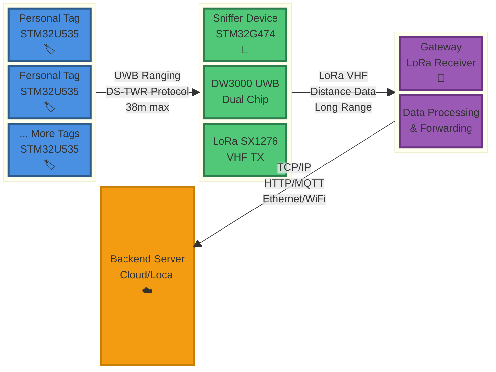
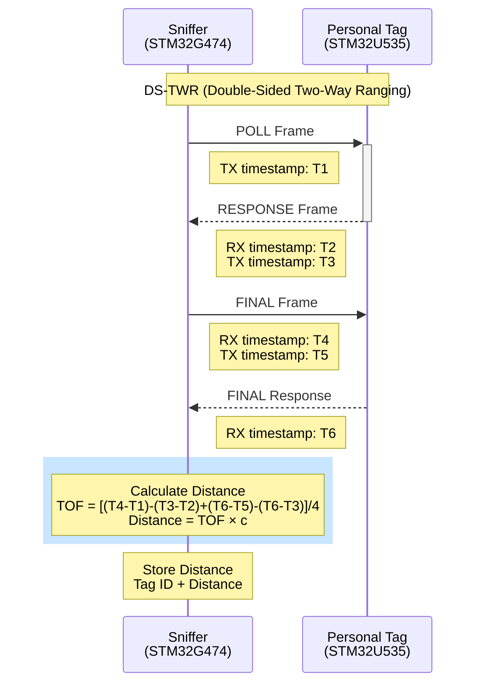
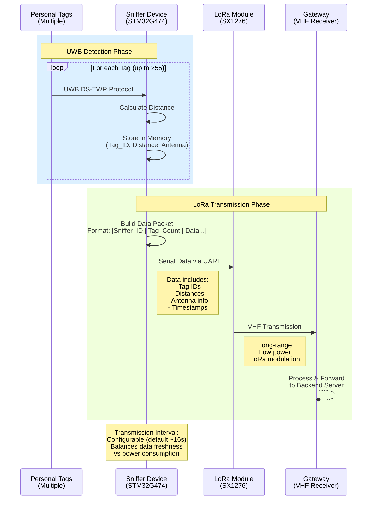

# fw-SmartTag

Firmware for the SmartTag UWB-based indoor localization system, consisting of personal tags and sniffer devices for real-time positioning.

## 🎯 System Overview



**Data Flow:** Tags (UWB) → Sniffer (LoRa VHF) → Gateway (Internet) → Backend Server

## 📦 Projects

### 🏷️ Persona (Personal Tag)
**MCU:** STM32U535VET  
**Role:** UWB responder worn by personnel

**Features:**
- UWB communication with DW3000
- Battery management (BQ25150)
- RGB LED status indicator (WS2812)
- Low-power sleep modes
- I2C & GPIO interfaces

### 📡 Sniffer-Tag (Location Anchor)
**MCU:** STM32G474RET  
**Role:** UWB initiator for distance measurement

**Features:**
- Dual DW3000 UWB chips (DS-TWR protocol)
- LoRa transmission (SX1276, VHF band)
- 8 configurable UWB timeouts
- EEPROM configuration storage
- UART command interface
- Supports up to 255 tags per sniffer
- Gateway communication via LoRa VHF

### 🛠️ Tools
GUI applications for configuration and monitoring:
- `sniffer_tag_gui.py` - UWB timeout configuration
- `gui_tool.py` - Detection history and CSV export
- `jira_manager.py` - Development workflow integration

## 🚀 Quick Start

1. **Clone repository:**
   ```bash
   git clone https://github.com/uqomm/fw-SmartTag.git
   cd fw-SmartTag
   ```

2. **Open in STM32CubeIDE:**
   - Import the desired project (Persona or sniffer-tag)
   - Build for Debug or Release

3. **Flash firmware:**
   - Connect ST-LINK programmer
   - Flash to target device

## 📚 Documentation

Comprehensive technical documentation is available in the `docs/` submodule:
- System architecture and specifications
- UWB timeout configuration guide
- Migration guides (850K baud rate)
- Protocol specifications
- Test reports and analysis

Access docs: `docs/docs/fw-smartTag/`

## 🏗️ Development

- **IDE:** STM32CubeIDE
- **Language:** C/C++
- **HAL:** STM32 HAL Drivers
- **Version Control:** Git with submodules

## 📋 Changelog

See project-specific CHANGELOGs:
- [Sniffer-Tag CHANGELOG](sniffer-tag/CHANGELOG.md)
- [Persona CHANGELOG](Persona/CHANGELOG.md)
- [Tools CHANGELOG](tools/CHANGELOG.md)

## 📄 License

Proprietary - UQOMM

## 🤝 Contributing

1. Create a feature branch
2. Commit changes with descriptive messages
3. Push to branch and create Pull Request
4. Ensure all tests pass before merging

---

**Latest Release:** v1.1.0  
**Repository:** https://github.com/uqomm/fw-SmartTag

## 🔧 Hardware Specifications

### Communication Modules
- **UWB:** Qorvo DW3000 (6.5 GHz band, IEEE 802.15.4z)
- **LoRa:** Semtech SX1276 (VHF band for gateway communication)
- **Range:** UWB up to 38m, LoRa long-range to gateway

---

## 📊 Operation Flow Diagrams

### ONE DETECTION Mode - UWB Ranging Protocol



**ONE DETECTION Features:**
- Single measurement per tag per cycle
- High precision (±10cm according to DW3000 specs)
- Optimized for energy efficiency
- 8 configurable timeouts for reliability at >20m

---

### Sniffer Data Transmission Flow



**Transmission Protocol:**
- **Packet Structure:** Sniffer ID + Tag count + [Tag ID, Distance, Antenna] × N
- **Frequency:** VHF band (configurable)
- **Modulation:** LoRa (high range, low power)
- **Timeout:** 16 seconds LoRa send timeout
- **Error Handling:** Retry mechanism with logging
