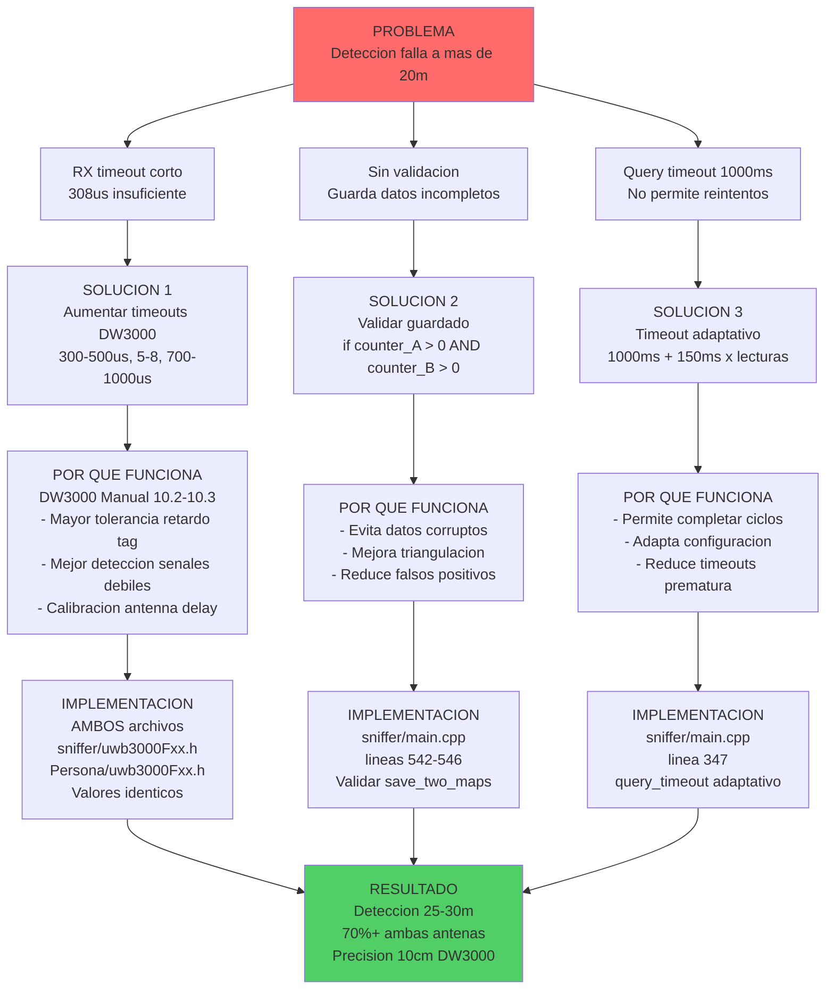

```mermaid
flowchart TD
    A[PROBLEMA<br/>Deteccion falla a mas de 20m] --> B[RX timeout corto<br/>308us insuficiente]
    A --> C[Sin validacion<br/>Guarda datos incompletos]
    A --> D[Query timeout 1000ms<br/>No permite reintentos]

    B --> E[SOLUCION 1<br/>Aumentar timeouts DW3000<br/>300-500us, 5-8, 700-1000us]
    C --> F[SOLUCION 2<br/>Validar guardado<br/>if counter_A > 0 AND counter_B > 0]
    D --> G[SOLUCION 3<br/>Timeout adaptativo<br/>1000ms + 150ms x lecturas]

    E --> H[POR QUE FUNCIONA<br/>DW3000 Manual 10.2-10.3<br/>- Mayor tolerancia retardo tag<br/>- Mejor deteccion senales debiles<br/>- Calibracion antenna delay]
    F --> I[POR QUE FUNCIONA<br/>- Evita datos corruptos<br/>- Mejora triangulacion<br/>- Reduce falsos positivos]
    G --> J[POR QUE FUNCIONA<br/>- Permite completar ciclos<br/>- Adapta configuracion<br/>- Reduce timeouts prematura]

    H --> K[IMPLEMENTACION<br/>AMBOS archivos<br/>sniffer/uwb3000Fxx.h<br/>Persona/uwb3000Fxx.h<br/>Valores identicos]
    I --> L[IMPLEMENTACION<br/>sniffer/main.cpp<br/>lineas 542-546<br/>Validar save_two_maps]
    J --> M[IMPLEMENTACION<br/>sniffer/main.cpp<br/>linea 347<br/>query_timeout adaptativo]

    K --> N[RESULTADO<br/>Deteccion 25-30m<br/>70%+ ambas antenas<br/>Precision 10cm DW3000]
    L --> N
    M --> N

    style A fill:#FF6B6B
    style N fill:#51CF66
```