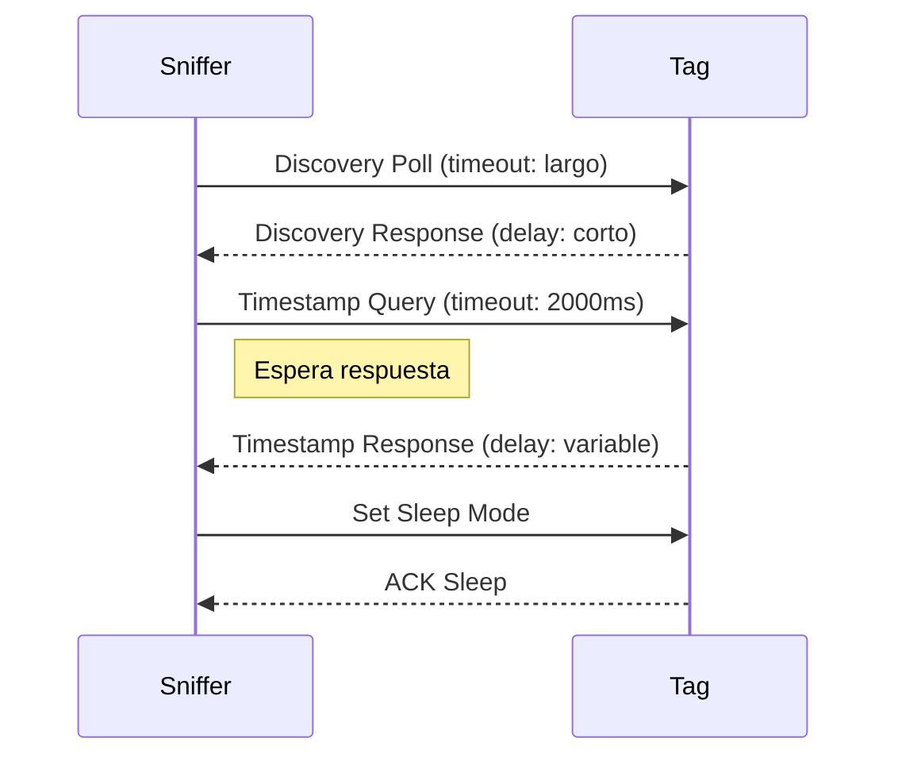

# Análisis de Discordancia en Lecturas UWB (>20m)

## 1. Introducción

Este documento analiza el flujo conversacional entre el sniffer y los tags, identificando posibles causas de discordancia en las lecturas de distancia cuando los tags se encuentran a más de 20 metros. Se consideran configuraciones, tiempos de espera y el protocolo de pregunta-respuesta.

---

## 2. Flujo Conversacional: Pregunta-Respuesta

### Secuencia típica para cada tag:

1. **Sniffer → Tag:** Discovery Poll
2. **Tag → Sniffer:** Discovery Response (ID)
3. **Sniffer → Tag:** Timestamp Query (A/B alternando)
4. **Tag → Sniffer:** Timestamp Response
5. **Sniffer:** Calcula distancia
6. **Sniffer → Tag:** Set Sleep Mode
7. **Tag → Sniffer:** ACK Sleep

---

## 3. Configuraciones y Tiempos de Espera Clave

### Sniffer
- **Timeout de recepción:**
  - Discovery: largo (para asegurar detección)
  - Timestamp Query: **1000 ms** fijo (`query_timeout`, puede ser insuficiente a >20m, se recomienda 1500-2000 ms)
- **Intervalo entre queries:**
  - Si el sniffer espera demasiado poco entre queries, el tag puede no estar listo para responder.
- **Cantidad de lecturas requeridas:**
  - Si el sniffer exige muchas lecturas por antena, puede agotar el tiempo antes de completarlas.

### Tag
- **Tiempo de respuesta:**
  - El tag puede tener un retardo interno antes de responder (procesamiento, radio wakeup, etc).
- **Modo bajo consumo:**
  - Si el tag entra en sleep demasiado rápido, puede perder queries.
- **Configuración de radio:**
  - Potencia de transmisión, sensibilidad de recepción, y tiempos de wakeup afectan la capacidad de respuesta a larga distancia.

---

## 4. Posibles Causas de Discordancia a >20m

### 4.1. Timeout insuficiente en el sniffer
- A mayor distancia, el tiempo de vuelo (ToF) del pulso UWB aumenta.
- El sniffer puede estar usando un timeout demasiado corto para la recepción de respuesta.
- Ejemplo: Si el timeout es 1000ms y la respuesta tarda 1200ms, la lectura se descarta.

### 4.2. Tag no preparado para responder
- Si el tag está en modo sleep o no ha terminado de procesar la query anterior, puede perder la ventana de respuesta.
- El sniffer puede enviar queries demasiado rápido, sin dar tiempo al tag para prepararse.

### 4.3. Configuración de radio subóptima
- Baja potencia de transmisión o sensibilidad insuficiente puede hacer que la señal no llegue a >20m.
- El tag puede recibir el poll pero no tener suficiente energía para responder.

### 4.4. Alternancia de antenas y sincronización
- Si el sniffer alterna antenas demasiado rápido, el tag puede no identificar correctamente de qué antena proviene la query.
- Discordancia en la secuencia de comandos puede causar que el tag ignore queries.

### 4.5. Manejo de errores y reintentos
- Si el sniffer no reintenta queries fallidas, puede perder lecturas válidas.
- Si el tag no reporta errores o no reintenta la transmisión, la comunicación se pierde.

---

## 5. Recomendaciones

1. **Aumentar timeout de recepción en el sniffer para queries a >20m**
2. **Agregar retardo entre queries para permitir al tag prepararse**
3. **Verificar configuración de radio en ambos equipos (potencia, sensibilidad, wakeup)**
4. **Implementar reintentos inteligentes en el sniffer ante fallos de respuesta**
5. **Sincronizar alternancia de antenas con confirmación de recepción en el tag**
6. **Registrar y analizar logs de tiempo de respuesta y errores para identificar el punto exacto de discordancia**

---

## 6. Diagrama de Flujo Conversacional con Tiempos

---

## 7. Conclusión

La discordancia en lecturas a más de 20 metros puede deberse principalmente a timeouts insuficientes, falta de sincronización en el flujo conversacional, o configuraciones de radio subóptimas. Ajustar estos parámetros y analizar los logs de ambos equipos permitirá identificar y corregir el problema.
