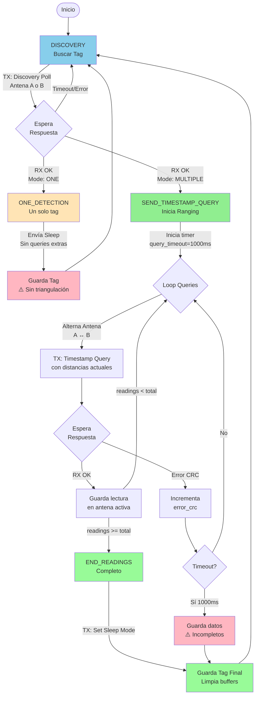
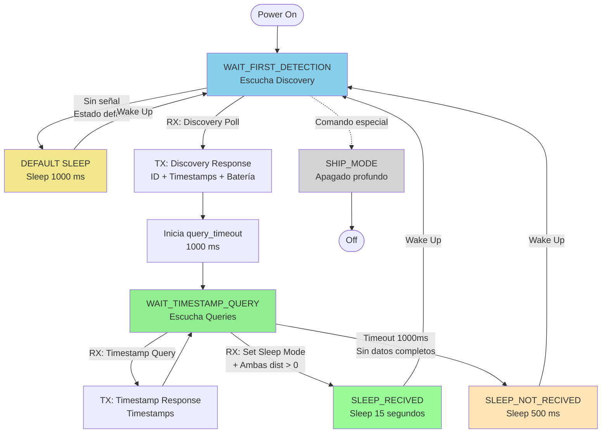
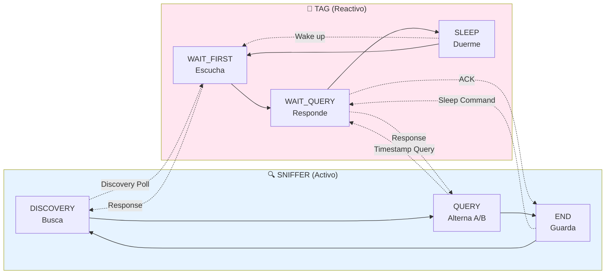
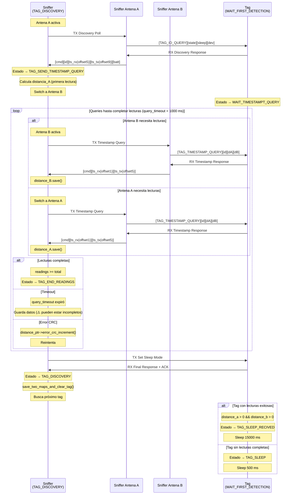
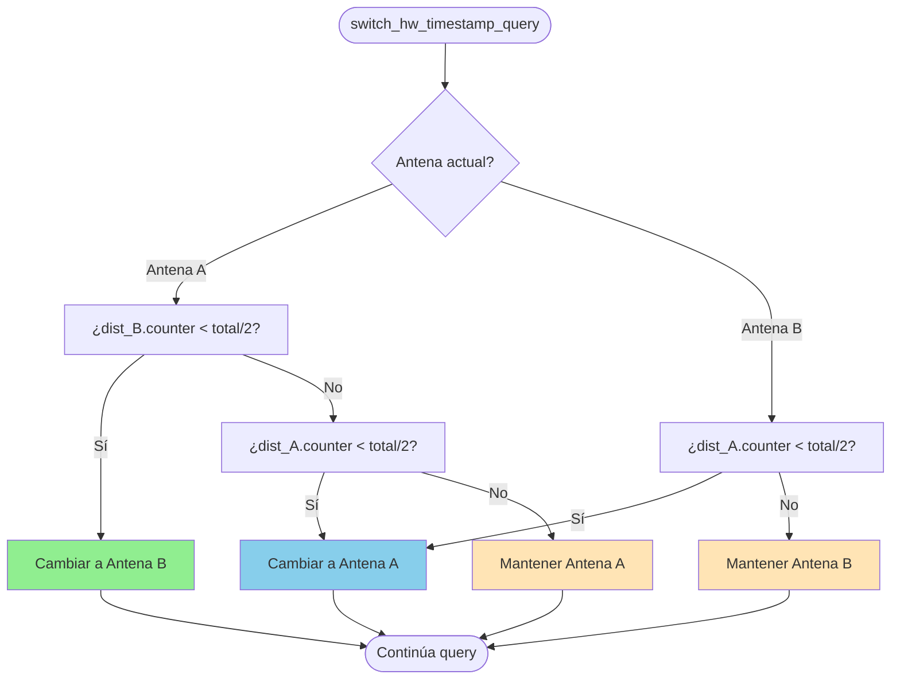

# Diagramas de Estado: Sniffer y Tag (Persona)

## 1. Máquina de Estados del Sniffer (Simplificada)

### Explicación del Flujo:

1. **DISCOVERY**: Busca tags cercanos, alterna antena cada vez
2. **ONE_DETECTION**: Modo especial para 1 tag (sin triangulación)
3. **SEND_TIMESTAMP_QUERY**: Hace ranging alternando antenas A/B
4. **END_READINGS**: Finaliza cuando completa lecturas o expira timeout
5. ⚠️ **Problema**: Guarda incluso con datos incompletos

---

## 2. Máquina de Estados del Tag/Persona (Simplificada)

### Explicación del Flujo:

1. **WAIT_FIRST_DETECTION**: Espera ser descubierto por sniffer
2. **WAIT_TIMESTAMP_QUERY**: Responde a queries de ranging
3. **SLEEP_RECIVED**: Sleep largo (15s) tras éxito con ambas distancias
4. **SLEEP_NOT_RECIVED**: Sleep corto (500ms) si falló o timeout
5. **DEFAULT SLEEP**: Sleep intermedio (1000ms) cuando no recibe ninguna señal
6. **SHIP_MODE**: Apagado profundo (opcional)

---

## 3. Comparación: Sniffer vs Tag

## 4. Diagrama de Secuencia Completo

## 5. Diagrama de Decisión: Alternancia de Antenas

---

## Notas Importantes:

1. **query_timeout crítico:** Ambos equipos (sniffer y tag) tienen 1000 ms para completar el ranging.

2. **Offsets diferentes:** Discovery usa offsets 5/9, queries usan 1/5 por estructura de frame distinta.

3. **Problema de guardado:** El código actual guarda tags incluso si solo una antena tiene lecturas, invalidando la triangulación.

4. **Alternancia inteligente:** `switch_hw_timestamp_query()` balancea lecturas entre antenas para asegurar datos de ambas.

5. **Sleep diferenciado:** Tag duerme 500 ms si falla, 15000 ms si tiene éxito.

6. **TAG_ONE_DETECTION:** Modo especial que omite queries adicionales, perdiendo capacidad de triangulación.
