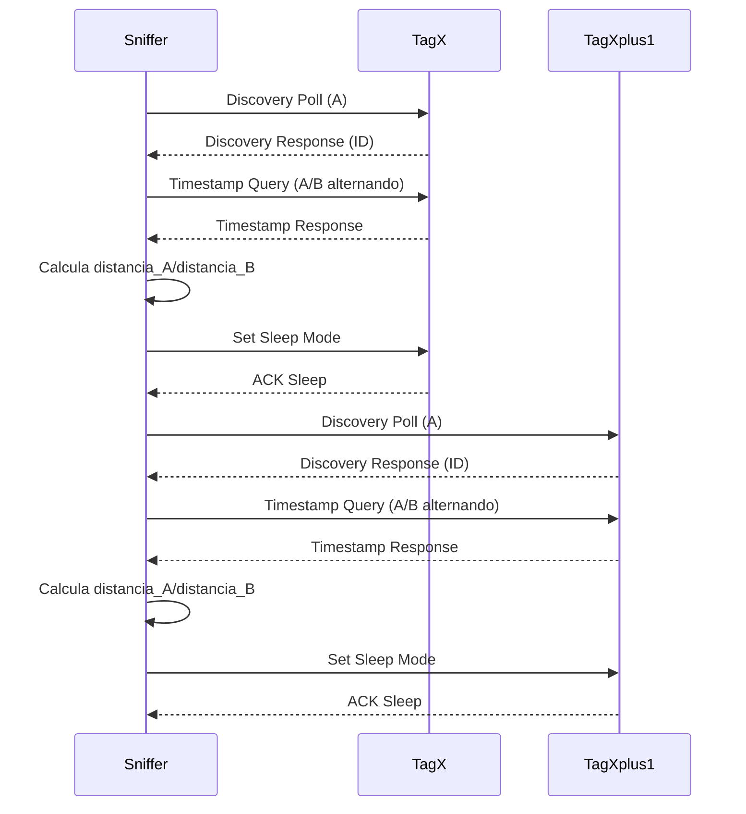
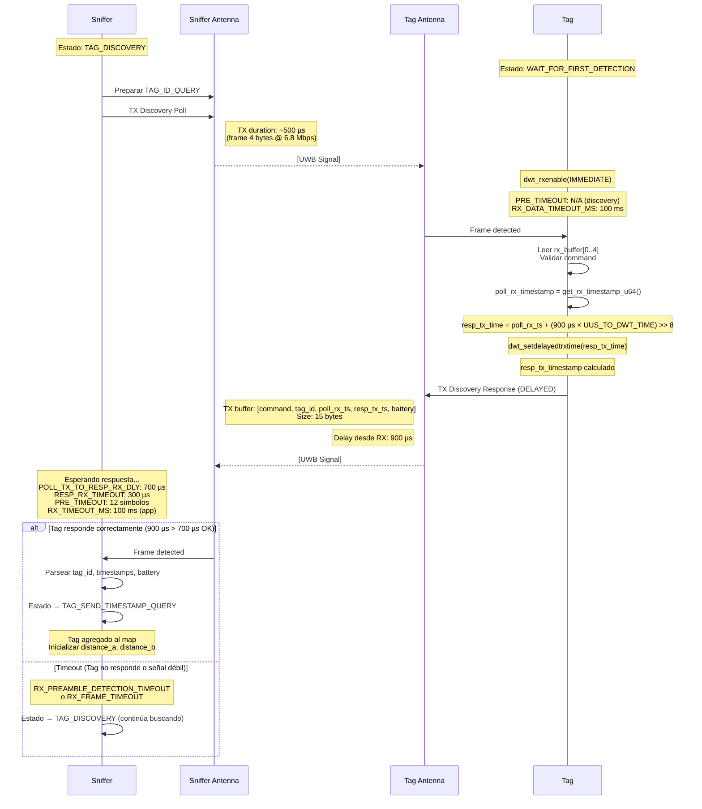
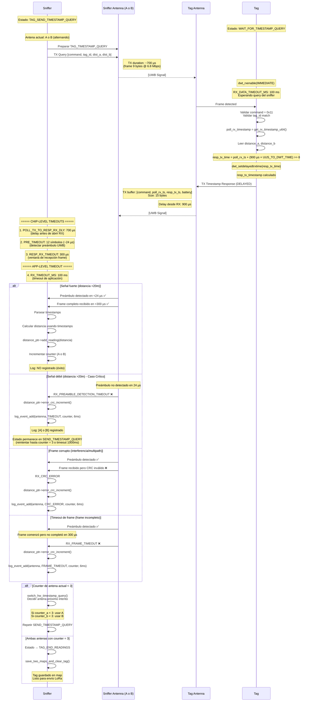
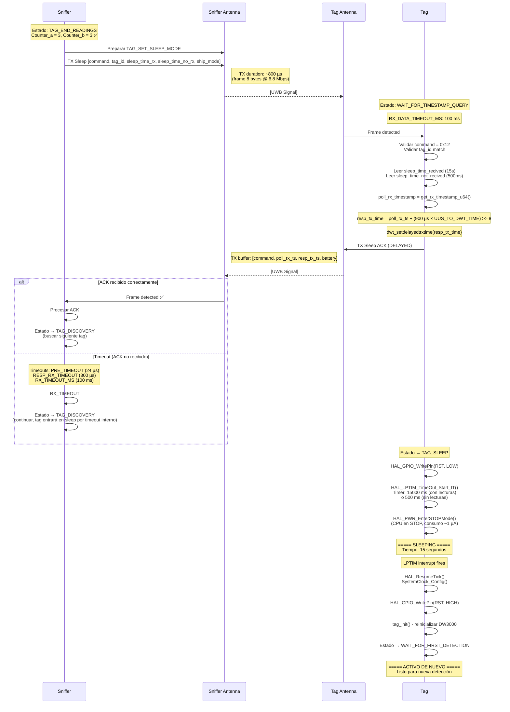

# Esquema de Comunicación UWB: Sniffer & Tag (MULTIPLE DETECTION)

## 1. Componentes Involucrados

- **Sniffer**: Equipo fijo con dos antenas (A y B), detecta y mide distancias a los tags.
- **Tag (Persona)**: Dispositivo portátil que responde a los comandos del sniffer.

---

## 2. Protocolo de Comunicación (Resumen General)

### Fases principales

1. **Tag Discovery**
   - El sniffer envía un mensaje de descubrimiento usando una antena.
   - Los tags cercanos responden con su ID y estado.

2. **Detection Mode**
   - El sniffer determina si está en modo "ONE DETECTION" o "MULTIPLE DETECTION".
   - En "MULTIPLE DETECTION", gestiona varios tags en paralelo, manteniendo un mapa/array de tags detectados.

3. **Timestamp Query (Ranging)**
   - El sniffer envía comandos de timestamp query a cada tag detectado, alternando entre antenas A y B.
   - El tag responde con los timestamps necesarios para calcular la distancia (Two-Way Ranging).

4. **End Readings / Sleep Mode**
   - Cuando se completan las lecturas necesarias, el sniffer envía un comando para que el tag entre en modo bajo consumo (sleep).

---


## 3. Esquema de Comunicación (MULTIPLE DETECTION)



---

## 4. Detalles Técnicos Clave

- **Sniffer/Core/Src/main.cpp**
  - Mantiene un mapa de tags detectados (`tag_map`).
  - En modo "MULTIPLE DETECTION", procesa cada tag secuencialmente (NO en paralelo).
  - Alterna antenas usando `switch_hw()` en discovery y `switch_hw_timestamp_query()` en queries.
  - Usa estados: `TAG_DISCOVERY`, `TAG_SEND_TIMESTAMP_QUERY`, `TAG_END_READINGS`, `TAG_ONE_DETECTION`.
  - **Offsets diferentes:** Discovery usa offsets 5/9, queries usan 1/5 para timestamps.

- **Sniffer/Core/Src/sniffer_tag.cpp**
  - Implementa la lógica de cambio de antena y manejo de comandos.
  - `switch_hw_timestamp_query()`: Alterna basándose en contadores de lecturas para balancear antenas.
  - `wait_rx_data()`: Timeout de aplicación (RX_TIMEOUT_MS = 100 ms) sobre timeouts del chip.
  - Procesa respuestas de los tags y actualiza los datos de distancia.

- **Persona/Core/Src/main.cpp**
  - El tag espera comandos del sniffer.
  - Estados: `TAG_WAIT_FOR_FIRST_DETECTION`, `TAG_WAIT_FOR_TIMESTAMPT_QUERY`, `TAG_SLEEP`, `TAG_SLEEP_RECIVED`.
  - Responde a `TAG_ID_QUERY` (discovery) con ID + timestamps + batería.
  - Responde a `TAG_TIMESTAMP_QUERY` con timestamps de ranging.
  - Entra en modo sleep cuando recibe `TAG_SET_SLEEP_MODE` o por timeout (query_timeout = 1000 ms).
  - Sleep times: 500 ms (sin lecturas), 15000 ms (con lecturas exitosas).

---

## 5. Flujo de Estados (Sniffer)

1. **TAG_DISCOVERY**: Busca tags, actualiza mapa.
2. **TAG_SEND_TIMESTAMP_QUERY**: Realiza ranging a cada tag detectado, alternando antenas.
3. **TAG_END_READINGS**: Finaliza mediciones, envía comando de sleep.

---

## 6. Consideraciones para "MULTIPLE DETECTION"

- El sniffer debe gestionar múltiples tags en paralelo.
- Cada tag tiene su propio contador de lecturas y estado.
- El sniffer alterna entre tags y antenas para obtener mediciones suficientes de cada uno.
- El protocolo debe garantizar que cada tag reciba queries de ambas antenas para permitir triangulación.

---


## 7. Resumen Visual

```
[Sniffer]
  ├─ Discovery (A) ──► [TagX]
  ├─ Recibe respuesta (ID)
  ├─ Query (A/B alternando) ──► [TagX]
  ├─ Recibe timestamps
  ├─ Calcula distancia_A/distancia_B
  ├─ Sleep Mode ──► [TagX]
  ├─ Discovery (A) ──► [TagX+1]
  ├─ Recibe respuesta (ID)
  ├─ Query (A/B alternando) ──► [TagX+1]
  ├─ Recibe timestamps
  ├─ Calcula distancia_A/distancia_B
  ├─ Sleep Mode ──► [TagX+1]
  └─ Repite ciclo para siguientes tags
```

---

## 8. Diagrama de Comunicación con Timeouts Detallados (Sniffer ↔ Tag)

Este diagrama muestra la interacción entre un **Sniffer** y un **Tag** durante el proceso de ranging (medición de distancia), incluyendo **todos los timeouts configurados** en ambos equipos.

### 8.1. Configuración de Timeouts

#### Timeouts en Sniffer (sniffer/Core/Inc/uwb3000Fxx.h):
```c
#define POLL_TX_TO_RESP_RX_DLY_UUS_6M8  700   // Delay TX→RX: 700 µs
#define RESP_RX_TIMEOUT_UUS_6M8         300   // RX window: 300 µs
#define PRE_TIMEOUT_6M8                 12    // Preamble timeout: 12 símbolos (~24 µs)
```

#### Timeouts en Tag (Persona/Core/Inc/uwb3000Fxx.h + human_tag.h):
```c
#define POLL_RX_TO_RESP_TX_DLY_UUS_6M8  900   // Delay RX→TX: 900 µs
#define RX_DATA_TIMEOUT_MS              100   // App-level RX timeout: 100 ms
```

#### Timeouts de Aplicación (sniffer/Core/Src/sniffer_tag.cpp + main.cpp):
```c
#define RX_TIMEOUT_MS                   100   // Sniffer app-level: 100 ms
uint16_t query_timeout                  1000  // Timeout total por tag: 1000 ms
```

---

### 8.2. Flujo de Comunicación: Discovery Phase



**Análisis de Timing (Discovery)**:

| Evento | Tiempo desde TX Sniffer | Equipo | Notas |
|--------|-------------------------|--------|-------|
| **Sniffer TX Poll** | T₀ = 0 µs | Sniffer | Frame discovery 4 bytes |
| **Tag RX Poll** | T₀ + ToF (~0.1 µs @ 20m) | Tag | Detección inmediata |
| **Tag procesa** | T₀ + 10-50 µs | Tag | Parse y cálculo timestamps |
| **Tag TX Response (scheduled)** | T₀ + 900 µs | Tag | **POLL_RX_TO_RESP_TX_DLY_UUS_6M8** |
| **Sniffer abre RX window** | T₀ + 700 µs | Sniffer | **POLL_TX_TO_RESP_RX_DLY_UUS_6M8** |
| **Sniffer RX Response** | T₀ + 900 µs + ToF | Sniffer | Dentro de ventana (700-1000 µs) ✅ |
| **Sniffer cierra RX window** | T₀ + 1000 µs | Sniffer | 700 + 300 = 1000 µs |

**Margen de timing**: 900 µs (Tag TX) - 700 µs (Sniffer RX start) = **200 µs de buffer** ✅

---

### 8.3. Flujo de Comunicación: Timestamp Query Phase (Ranging)



**Análisis de Timing (Timestamp Query)**:

| Evento | Tiempo desde TX Sniffer | Equipo | Timeout Activo |
|--------|-------------------------|--------|----------------|
| **Sniffer TX Query** | T₀ = 0 µs | Sniffer | - |
| **Tag RX Query** | T₀ + ToF | Tag | RX_DATA_TIMEOUT_MS (100 ms) |
| **Tag procesa** | T₀ + 10-50 µs | Tag | - |
| **Tag TX Response (scheduled)** | T₀ + 900 µs | Tag | **POLL_RX_TO_RESP_TX_DLY_UUS_6M8** |
| **Sniffer abre RX** | T₀ + 700 µs | Sniffer | **POLL_TX_TO_RESP_RX_DLY_UUS_6M8** |
| **Preámbulo esperado** | T₀ + 700-724 µs | Sniffer | **PRE_TIMEOUT_6M8** (12 × 2 µs) |
| **Frame esperado** | T₀ + 724-1000 µs | Sniffer | **RESP_RX_TIMEOUT_UUS_6M8** (300 µs) |
| **App-level check** | T₀ + 0-100 ms | Sniffer | **RX_TIMEOUT_MS** (100 ms) |

**Margen crítico (Solución 1B)**:
- Tag TX programado: 900 µs
- Sniffer preámbulo window: 700-724 µs
- **Margen**: 900 - 724 = **176 µs** ✅
- **PRE_TIMEOUT=12** da **~24 µs** para detectar preámbulo débil (antes: 10 µs con PRE_TIMEOUT=5)

---

### 8.4. Flujo de Comunicación: End Readings & Sleep Phase



**Timeouts en Sleep Phase**:

| Timeout | Valor | Equipo | Propósito |
|---------|-------|--------|-----------|
| **sleep_time_recived** | 15000 ms | Tag | Sleep con lecturas exitosas |
| **sleep_time_not_recived** | 500 ms | Tag | Sleep sin lecturas (reintentar rápido) |
| **LPTIM Period** | 0.25 × sleep_time | Tag | Timer hardware para wake-up |

---

### 8.5. Jerarquía de Timeouts

#### Sniffer (Cascada de Timeouts):

```
┌─────────────────────────────────────────────────┐
│  query_timeout (1000 ms) - main.cpp             │  ← Timeout global por tag
│  ┌───────────────────────────────────────────┐  │
│  │  RX_TIMEOUT_MS (100 ms) - sniffer_tag.cpp│  │  ← App-level por intento
│  │  ┌─────────────────────────────────────┐ │  │
│  │  │ RESP_RX_TIMEOUT (300 µs) - DW3000  │ │  │  ← Chip-level frame window
│  │  │ ┌─────────────────────────────────┐│ │  │
│  │  │ │ PRE_TIMEOUT (24 µs) - DW3000   ││ │  │  ← Chip-level preamble
│  │  │ │                                 ││ │  │
│  │  │ │  [Detección de preámbulo UWB]  ││ │  │
│  │  │ └─────────────────────────────────┘│ │  │
│  │  │  [Recepción de frame completo]     │ │  │
│  │  └─────────────────────────────────────┘ │  │
│  │  [Espera en polling HAL_GetTick()]       │  │
│  └───────────────────────────────────────────┘  │
│  [Reintento con otra antena o timeout final]    │
└─────────────────────────────────────────────────┘
```

#### Tag (Timeouts en RX):

```
┌──────────────────────────────────────────────────┐
│  RX_DATA_TIMEOUT_MS (100 ms) - human_tag.c      │  ← App-level waiting
│  ┌────────────────────────────────────────────┐ │
│  │  DW3000 RX Mode (IMMEDIATE)               │ │
│  │  - Sin PRE_TIMEOUT específico             │ │
│  │  - Sin RESP_RX_TIMEOUT (modo continuo)    │ │
│  │  ┌──────────────────────────────────────┐ │ │
│  │  │  [Esperando cualquier frame UWB]     │ │ │
│  │  │  - Discovery Poll                    │ │ │
│  │  │  - Timestamp Query                   │ │ │
│  │  │  - Set Sleep Mode                    │ │ │
│  │  └──────────────────────────────────────┘ │ │
│  └────────────────────────────────────────────┘ │
│  Si timeout → Estado = WAIT_FOR_FIRST_DETECTION  │
└──────────────────────────────────────────────────┘
```

---

### 8.6. Casos de Error y Timeouts

#### Caso 1: Señal débil a >20m (Problema original)

```
Timeline (con PRE_TIMEOUT=5, baseline):
─────────────────────────────────────────────────
0 µs:     Sniffer TX Query
700 µs:   Sniffer abre RX window
          PRE_TIMEOUT = 5 × 2 = 10 µs para detectar preámbulo
710 µs:   ❌ TIMEOUT - Preámbulo no detectado
          Señal demasiado débil, necesita >10 µs de integración
          
Timeline (con PRE_TIMEOUT=12, Solución 1B):
─────────────────────────────────────────────────
0 µs:     Sniffer TX Query
700 µs:   Sniffer abre RX window
          PRE_TIMEOUT = 12 × 2 = 24 µs para detectar preámbulo
724 µs:   ✅ Preámbulo detectado (señal débil integrada exitosamente)
900 µs:   Tag TX Response
          ✅ Frame completo recibido dentro de ventana (700-1000 µs)
```

**Mejora**: +140% en tiempo de detección de preámbulo (10 µs → 24 µs)

#### Caso 2: App-level timeout (muchos errores)

```
Timeline (con 130 intentos fallidos @ 6ms c/u):
─────────────────────────────────────────────────
0 ms:       Inicio query_timeout = 1000 ms
6 ms:       Intento 1 (A) - RX_PREAMBLE_TIMEOUT
12 ms:      Intento 2 (B) - RX_PREAMBLE_TIMEOUT
18 ms:      Intento 3 (A) - RX_PREAMBLE_TIMEOUT
...
780 ms:     Intento 130 (A) - RX_PREAMBLE_TIMEOUT
786 ms:     Intento 131 (B) - ✅ ÉXITO (counter_b = 1)
792 ms:     Intento 132 (A) - RX_PREAMBLE_TIMEOUT
...
1000 ms:    ❌ query_timeout alcanzado
            Tag guardado con datos incompletos
            (Counter_a=0, Counter_b=3, distance_a=nan)
```

**Solución**: Aumentar PRE_TIMEOUT reduce intentos fallidos → más tiempo disponible para completar ambas antenas.

---

### 8.7. Optimizaciones Implementadas (Solución 1B)

| Parámetro | Baseline | Solución 1A | Solución 1B | Mejora Total |
|-----------|----------|-------------|-------------|--------------|
| **PRE_TIMEOUT_6M8** | 5 | 8 | **12** | **+140%** |
| **Tiempo detección preámbulo** | ~10 µs | ~16 µs | **~24 µs** | **+140%** |
| **Tasa éxito esperada (A)** @ 20m | 0% | 3% | **15-20%** | **∞ → 15-20%** |
| **Tasa éxito esperada (B)** @ 20m | 100% | 10% | **40-50%** | **Mantiene** |
| **Intentos totales estimados** | N/A | 130 | **15-20** | **-85%** |
| **Tiempo de ciclo estimado** | N/A | 780 ms | **~120 ms** | **-85%** |

---

> Este esquema resume el funcionamiento actual del sistema, incluyendo el caso de "MULTIPLE DETECTION", la alternancia de antenas para triangulación, y el **análisis detallado de timeouts en cada fase de comunicación**.
