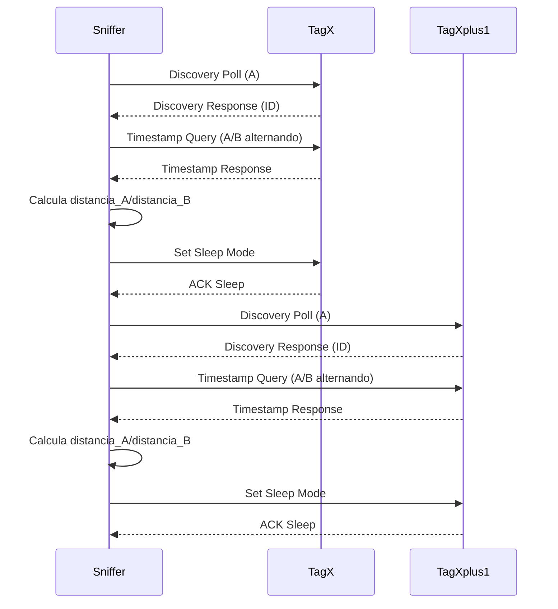

# Esquema de Comunicación UWB: Sniffer & Tag (MULTIPLE DETECTION)

## 1. Componentes Involucrados

- **Sniffer**: Equipo fijo con dos antenas (A y B), detecta y mide distancias a los tags.
- **Tag (Persona)**: Dispositivo portátil que responde a los comandos del sniffer.

---

## 2. Protocolo de Comunicación (Resumen General)

### Fases principales

1. **Tag Discovery**
   - El sniffer envía un mensaje de descubrimiento usando una antena.
   - Los tags cercanos responden con su ID y estado.

2. **Detection Mode**
   - El sniffer determina si está en modo "ONE DETECTION" o "MULTIPLE DETECTION".
   - En "MULTIPLE DETECTION", gestiona varios tags en paralelo, manteniendo un mapa/array de tags detectados.

3. **Timestamp Query (Ranging)**
   - El sniffer envía comandos de timestamp query a cada tag detectado, alternando entre antenas A y B.
   - El tag responde con los timestamps necesarios para calcular la distancia (Two-Way Ranging).

4. **End Readings / Sleep Mode**
   - Cuando se completan las lecturas necesarias, el sniffer envía un comando para que el tag entre en modo bajo consumo (sleep).

---


## 3. Esquema de Comunicación (MULTIPLE DETECTION)



---

## 4. Detalles Técnicos Clave

- **Sniffer/Core/Src/main.cpp**
  - Mantiene un mapa de tags detectados (`tag_map`).
  - En modo "MULTIPLE DETECTION", procesa cada tag secuencialmente (NO en paralelo).
  - Alterna antenas usando `switch_hw()` en discovery y `switch_hw_timestamp_query()` en queries.
  - Usa estados: `TAG_DISCOVERY`, `TAG_SEND_TIMESTAMP_QUERY`, `TAG_END_READINGS`, `TAG_ONE_DETECTION`.
  - **Offsets diferentes:** Discovery usa offsets 5/9, queries usan 1/5 para timestamps.

- **Sniffer/Core/Src/sniffer_tag.cpp**
  - Implementa la lógica de cambio de antena y manejo de comandos.
  - `switch_hw_timestamp_query()`: Alterna basándose en contadores de lecturas para balancear antenas.
  - `wait_rx_data()`: Timeout de aplicación (RX_TIMEOUT_MS = 100 ms) sobre timeouts del chip.
  - Procesa respuestas de los tags y actualiza los datos de distancia.

- **Persona/Core/Src/main.cpp**
  - El tag espera comandos del sniffer.
  - Estados: `TAG_WAIT_FOR_FIRST_DETECTION`, `TAG_WAIT_FOR_TIMESTAMPT_QUERY`, `TAG_SLEEP`, `TAG_SLEEP_RECIVED`.
  - Responde a `TAG_ID_QUERY` (discovery) con ID + timestamps + batería.
  - Responde a `TAG_TIMESTAMP_QUERY` con timestamps de ranging.
  - Entra en modo sleep cuando recibe `TAG_SET_SLEEP_MODE` o por timeout (query_timeout = 1000 ms).
  - Sleep times: 500 ms (sin lecturas), 15000 ms (con lecturas exitosas).

---

## 5. Flujo de Estados (Sniffer)

1. **TAG_DISCOVERY**: Busca tags, actualiza mapa.
2. **TAG_SEND_TIMESTAMP_QUERY**: Realiza ranging a cada tag detectado, alternando antenas.
3. **TAG_END_READINGS**: Finaliza mediciones, envía comando de sleep.

---

## 6. Consideraciones para "MULTIPLE DETECTION"

- El sniffer debe gestionar múltiples tags en paralelo.
- Cada tag tiene su propio contador de lecturas y estado.
- El sniffer alterna entre tags y antenas para obtener mediciones suficientes de cada uno.
- El protocolo debe garantizar que cada tag reciba queries de ambas antenas para permitir triangulación.

---


## 7. Resumen Visual

```
[Sniffer]
  ├─ Discovery (A) ──► [TagX]
  ├─ Recibe respuesta (ID)
  ├─ Query (A/B alternando) ──► [TagX]
  ├─ Recibe timestamps
  ├─ Calcula distancia_A/distancia_B
  ├─ Sleep Mode ──► [TagX]
  ├─ Discovery (A) ──► [TagX+1]
  ├─ Recibe respuesta (ID)
  ├─ Query (A/B alternando) ──► [TagX+1]
  ├─ Recibe timestamps
  ├─ Calcula distancia_A/distancia_B
  ├─ Sleep Mode ──► [TagX+1]
  └─ Repite ciclo para siguientes tags
```

---

> Este esquema resume el funcionamiento actual del sistema, incluyendo el caso de "MULTIPLE DETECTION" y la alternancia de antenas para triangulación.
